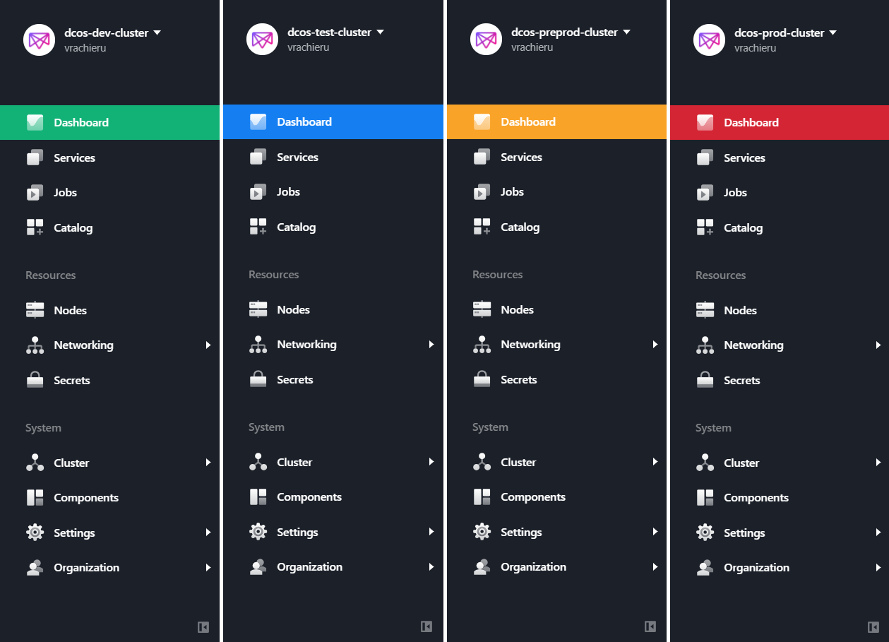

# DC/OS cluster color

Assign different colors to the DC/OS UI so you don't do bad stuff in production by mistake.

## Example

## Preparation

1. Edit DC/OS hosts in [manifest.json](src/manifest.json#L12)
2. Edit cluster names and colors in [content.js](src/content.js#L6)

## Installation

1. Go to [chrome://extensions/](chrome://extensions/)
2. Enable `Developer mode`
3. Click `Load unpacked` and select the `src` directory of this repo
4. Profit